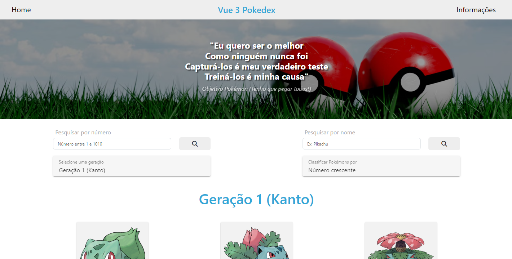

# Pokedex



## Descrição

Um aplicativo da web para visualizar e pesquisar Pokémon usando Vue 3 e PokeAPI.

## Tecnologias Utilizadas

- **Vue 3**: O framework principal usado para construir a aplicação.
- **TypeScript**: fornece digitação estática para melhorar a qualidade e a capacidade de manutenção do código.
- **Vite**: um servidor de desenvolvimento e ferramenta de construção rápido e leve.
- **Pinia**: Para gerenciamento de estado, oferecendo uma API mais simples e melhor suporte a TypeScript em comparação com Vuex.
- **PrimeVue**: uma biblioteca de componentes de UI usada para criar componentes responsivos e visualmente atraentes.
- **PrimeFlex**: Uma biblioteca de utilitários CSS usada em conjunto com PrimeVue para layout e estilo.
- **PrimeIcons**: Biblioteca de ícones para adicionar ícones vetoriais ao aplicativo.
- **ESLint**: Para linting para garantir a qualidade do código.
- **Mais bonito**: Para formatação de código para manter um estilo consistente.
- **Vitest**: uma estrutura rápida de testes unitários.
- **@testing-library/vue**: Para testar componentes Vue de uma forma que se assemelhe às interações do usuário.
- **Cliente Apollo**: Para fazer consultas GraphQL ao PokeAPI.

## Instalação

1. Clone o repositório:

   ```sh
   git clone [<repository-url>](https://github.com/marciodutra/PokedexPronto.git)
   ```

2. Navegue até o diretório do projeto:

   ```sh
   cd pokedex
   ```

### Usando npm

3. Instale dependências:
   ```sh
   npm install ou  npm install --legacy-peer-deps
   ```

### Usando pnpm

3. Instale dependências:
   ```sh
   pnpm install
   ```

### usando yarn

3. Instale dependências:
   ```sh
   yarn install
   ```

## Executando o aplicativo

### Usando npm

1. Inicie o servidor de desenvolvimento:

   ```sh
   npm run dev
   ```

2. Abra o navegador e navegue até `http://localhost:5173`

### Usando pnpm

1. Inicie o servidor de desenvolvimento:


   ```sh
   pnpm run dev
   ```

2. Abra o navegador e navegue até `http://localhost:5173`

### Usando yarn

1. Inicie o servidor de desenvolvimento:

   ```sh
   yarn dev
   ```

2. Abra o navegador e navegue até `http://localhost:5173`

## Decision Explanation

- **Vue 3 com TypeScript**: aproveitado por seus recursos de digitação estática, que melhoram a qualidade e a capacidade de manutenção do código.
- **PrimeVue e PrimeFlex**: Utilizados para construção de UI rápida e eficiente, garantindo um design responsivo.
- **PokeAPI**: Escolhido por sua robustez e facilidade de uso, fornecendo um conjunto abrangente de dados para Pokémon.
